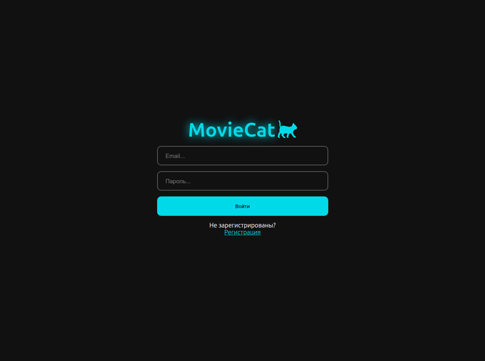
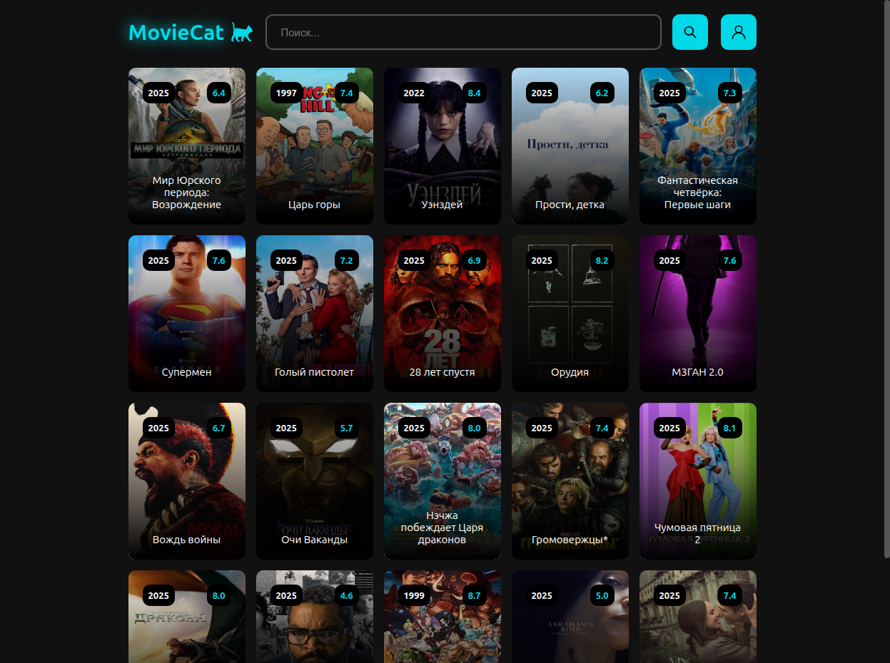
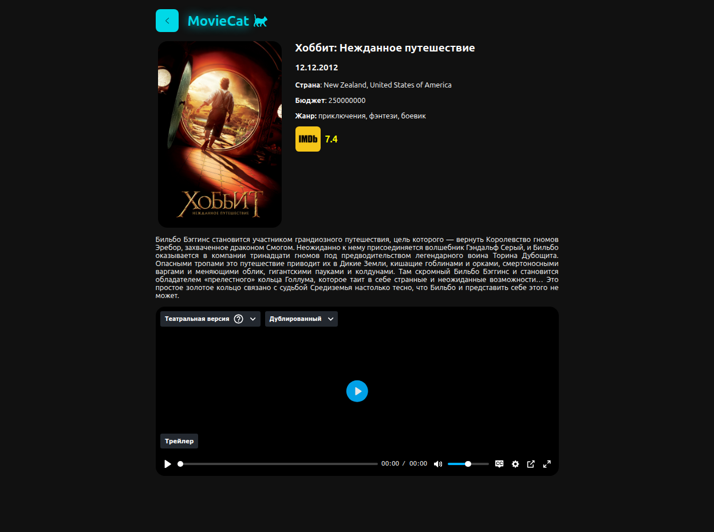

# 🎬 Moviecat

> Интерактивное веб-приложение для поиска и просмотра фильмов и сериалов онлайн.

## ✨ Демонстрация

🌐 [Посмотреть проект онлайн](https://moviecat.eagle.dev.stack.fvds.ru)

## 📖 Описание проекта

> Данный проект предоставляет пользователям возможность просмотра и поиска фильмов и сериалов онлайн. Проект был создан для того, чтобы попрактиковаться в работе с React, Node.js, TypeScript, Express и Docker.

## 🛠️ Технологии и Стек

| Технология | Описание                                                                         |
| ---------- | -------------------------------------------------------------------------------- |
| React      | UI библиотека для построения интерфейса                                          |
| Node.js    | Серверная часть                                                                  |
| Express    | Легкий серверный фреймворк                                                       |
| PostgreSQL | База данных пользователей                                                        |
| Redis      | Хранилище сессий в формате ключ:значение                                         |
| Docker     | Программная платформа для разработки, доставки и запуска контейнерных приложений |

## 📷 Скриншоты

## ✍️ Автор

- [@NikolasEagle](https://github.com/NikolasEagle)
- Telegram: [https://t.me/EglPC](https://t.me/EglPC)